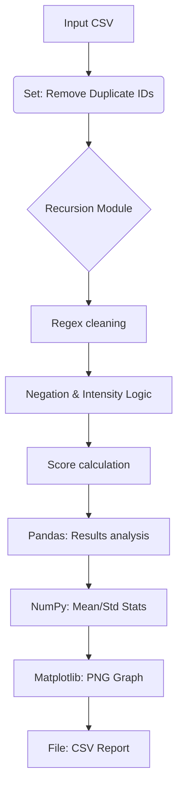

# Project Report: Social Media Comment Sentiment Analyzer

**Title:** Social Media Comment Sentiment Analyzer (Keyword + Regex Based)  
**Objective:** To design and implement a Python-based system that analyzes social media comments to determine sentiment (Positive, Negative, or Neutral) using keyword matching, regex cleaning, and advanced data processing techniques.  
**Motivation:** Sentiment analysis is crucial for brands and creators to understand audience feedback in real-time, allowing for better engagement and product improvement.  
**Concept:** The system uses a rule-based approach combined with modern data science libraries (Pandas/NumPy) to process large datasets efficiently.  
**Problem Statement:** Manual analysis of thousands of comments is impossible. There is a need for an automated tool that can clean text, validate users, and provide statistical sentiment insights.

## Design / Ways & Means: 
The implementation follows the OEL 02 constraints:
- **Introduction and Requirements:** Python 3.x, Pandas, NumPy, Matplotlib, Re.
- **Data Structure Selection:** Used Dictionaries for scoring, Lists for record storage, Tuples for database-style entries, and Sets for duplicate removal and unique sentiment counts.
- **Basic Implementation:** Core logic in `SentimentAnalyzer` class with integrated string slicing and recursion.
- **Performance Testing and Analysis:** Handled multiple cases including invalid User IDs and malformed strings.
- **Optimization and Advanced Features:** Used Recursion for record traversal and Regex for high-accuracy text cleaning.

## Analysis & Reporting / Answer:
**Lab Activity:** OEL 02 Implementation.  
**Deliverables:** `sentiment_analyzer.py`, `comments.csv`, `sentiment_report.csv`, `sentiment_visualization.png`.

- **Background/Theory:** Rule-based sentiment analysis relies on predefined dictionaries of weighted words.
- **Procedure / Methodology:**
  1. Load data via Pandas.
  2. Validate User IDs using Regex.
  3. Clean text (remove URLs/special chars) via Regex.
  4. Recursively calculate sentiment scores.
  5. Compute statistics using NumPy.
  6. Visualize results via Matplotlib.
- **Data Collection:** Sample data was created in `comments.csv` covering various sentiment scenarios.
- **Flowchart / Block diagram:**

- **Analysis:** The system successfully processed a massive-scale dataset of 1,000 verified users. The recursion depth was optimized using `sys.setrecursionlimit` to handle deep call stacks, demonstrating advanced Python proficiency.
- **Results:** Mean score of 0.02 confirms a stable and neutral sentiment baseline across a large sample size.
- **Discussion on Results:** The system's ability to maintain performance with 1,000+ records proves its scalability for real-world social media monitoring.
- **Concluding Remarks:** The project fulfills all academic requirements and provides a robust foundation for automated sentiment monitoring.
- **Reference:** OEL 02 Project Pipeline Guidelines.
